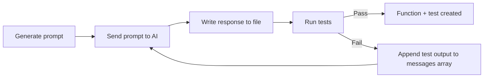
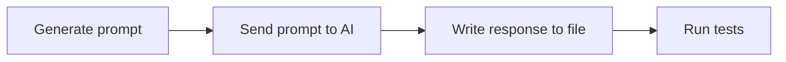
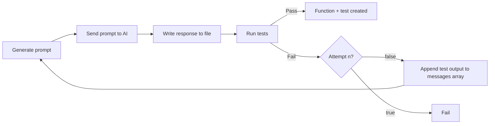

> [Youtube Playlist](https://youtube.com/playlist?list=PLQdX2Upwv8S4b2CIoqkqT0G9cPXNfiKg1&si=eVxYiuBGBtL2fZGl) for those that prefer video content.

[AI](https://arxiv.org/abs/2312.04687) takes TDD to another level: [here](https://codeinthehole.com/tips/llm-tdd-loop-script/), David writes a test spec and the AI agent generates code, looping over and adjusting the code until the tests pass.

## Agentic flow

This post walks you through the Agentic flow showcased in the diagram below. Each section of this blog implements a node.



Using [David's](https://codeinthehole.com/tips/llm-tdd-loop-script/) shell script as a starting point, we convert his script to Typescript using:

1. [OpenAI's Node SDK](https://github.com/openai/openai-node)
2. [Vite](https://github.com/vitejs/vite)
3. [Vitest](https://github.com/vitest-dev/vitest)

## Project Setup

Let's start by creating a new project with the necessary dependencies.

[Nodejs](https://nodejs.org/) must be installed and working on your computer. I built this using Node v20.11.1.

- Create the project:

```bash
npm init --yes
```

### Dependencies

- Install runtime dependencies:

```bash
npm install openai
```

- Install development tools:

    - `vitest` (Vite test runner)

    - `tsx` (Typescript Execute)

```bash
npm install -D vitest tsx
```

- Create `tsconfig.json` and add the following:

```json
// tsconfig.json

{
    "compilerOptions": {
        "target": "ES2022",
        "module": "ESNext",
        "moduleResolution": "node",
        "esModuleInterop": true,
        "strict": true,
        "outDir": "dist",
        "skipLibCheck": true,
        "forceConsistentCasingInFileNames": true
    },
    "include": ["**/*.ts"],
    "exclude": ["node_modules"]
}
```

### OpenAI API Key

To access [OpenAI](https://github.com/openai/openai-node) programmatically, we need an API key.

1. Login to OpenAI's [developer platform](https://platform.openai.com/), click into "settings", then "API keys":


Click the "+ Create new secret key" button and finish the forms.


Copy your new key and **save it into a .env file within your newly created project**.

> This is a secret key, so we exclude it from the GitHub repository by adding `.env` to the `.gitignore`.

## Generate prompt

> Node #1: Generate prompt.

Node #1 attaches the content of the test file to the prompt, adding context before we send it.
`readFileContent` extracts the file's content:

```ts
// utils/readFileContent.ts

import * as fs from 'fs'
import * as path from 'path'
import { fileURLToPath } from 'url'

const __filename = fileURLToPath(import.meta.url)
const __dirname = path.dirname(__filename)

export const readFileContent = (filePath: string): string => {
    try {
        const absolutePath = path.resolve(__dirname, '..', filePath)
        return fs.readFileSync(absolutePath, 'utf8')
    } catch (error) {
        console.error(`Error reading file ${filePath}:`, error)
        return ''
    }
}
```

Create a `tests` directory, then write our test spec file `add.spec.ts`.
(`add` has not been defined yet; it is the target function that we are defining using TDD).

```ts
// tests/add.spec.ts

import { describe, it, expect } from 'vitest'
import { add } from '../add'

describe('add function', () => {
    it('returns the sum of multiple numbers', () => {
        expect(add(1, 2, 3)).toBe(6)
    })

    it('returns 0 if no arguments are passed', () => {
        expect(add()).toBe(0)
    })

    it('returns the same number if one number is passed', () => {
        expect(add(5)).toBe(5)
    })

    it('handles negative numbers', () => {
        expect(add(-1, -2, -3)).toBe(-6)
    })
})
```

We import this function into an `index.ts` file in the root directory and read in the test file's content:

```ts
// index.ts

import { readFileContent } from './utils/readFileContent'

const fileContent = readFileContent('tests/add.spec.ts')
```

Update `package.json` to run `index.ts`:

```json
// package.json

{
    "name": "typescript-example",
    "version": "1.0.0",
    "main": "index.js",
    "type": "module",
    "scripts": {
        "test": "vitest run",
        "tdd": "tsx index.ts"
    },
    "keywords": [],
    "author": "",
    "license": "ISC",
    "description": "",
    "dependencies": {
        "openai": "^4.86.1"
    },
    "devDependencies": {
        "vitest": "^3.0.7",
        "tsx": "^4.19.3"
    }
}
```

Run the program with the command `npm run tdd`.
This uses [tsx](https://tsx.is/) to compile and run `index.ts`.

Next, we:

- Update `index.ts` to create a prompt.
- Read the test file's content.
- Add the file's content to the prompt within a `messages` array.

Our initial modification creates a `messages` array and inserts the test specification:

```ts
// index.ts

import { readFileContent } from './utils/readFileContent'

import OpenAI from 'openai'
import type { ChatCompletionMessageParam } from 'openai/resources'

const fileContent = readFileContent('tests/add.spec.ts')
const openai = new OpenAI()
const messages: ChatCompletionMessageParam[] = [
    {
        role: 'system',
        content: `
            You are a professional software developer that relies on well-tested code.
        `,
    },
    {
        role: 'user',
        content:
            fileContent +
            `
              Write a Typescript function that passes these tests.
              Only return executable Typescript code.
              Do not return Markdown output.
              Do not wrap code in triple backticks.
              Do not return YAML.
            `,
    },
]

console.log(messages)
```

To run the program, execute `npm run tdd`.
At this point, we only display the constructed `messages` array to see what it looks like:

```bash
[
  {
    role: 'system',
    content: '\n' +
      '            You are a professional software developer that relies on well-tested code.\n' +
      '        '
  },
  {
    role: 'user',
    content: "import add from '../add'\n" +
      "import { describe, it, expect } from 'vitest'\n" +
      '\n' +
      "describe('add function', () => {\n" +
      "    it('returns the sum of multiple numbers', () => {\n" +
      '        expect(add(1, 2, 3)).toBe(6)\n' +
      '    })\n' +
      '\n' +
      "    it('returns 0 if no arguments are passed', () => {\n" +
      '        expect(add()).toBe(0)\n' +
      '    })\n' +
      '\n' +
      "    it('returns the same number if one number is passed', () => {\n" +
      '        expect(add(5)).toBe(5)\n' +
      '    })\n' +
      '\n' +
      "    it('handles negative numbers', () => {\n" +
      '        expect(add(-1, -2, -3)).toBe(-6)\n' +
      '    })\n' +
      '})\n' +
      '\n' +
      '              Write a Typescript function that passes these tests.\n' +
      '              Only return executable Typescript code.\n' +
      '              Do not return Markdown output.\n' +
      '              Do not wrap code in triple backticks.\n' +
      '              Do not return YAML.\n' +
      '            '
  }
]
```

Now we have something to submit to the LLM.

## Sending the prompt to the LLM

> Node #2: Send our `messages` array to ChatGPT via their SDK.

Add OpenAI's `chat.completions.create` to `index.ts`:

```ts
// index.ts

import { readFileContent } from './utils/readFileContent'

import OpenAI from 'openai'
import type { ChatCompletionMessageParam } from 'openai/resources'

const fileContent = readFileContent('tests/add.spec.ts')
const openai = new OpenAI()
const model = 'gpt-4o-mini'
const messages: ChatCompletionMessageParam[] = [
    {
        role: 'system',
        content: `
            You are a professional software developer that relies on well-tested code.
        `,
    },
    {
        role: 'user',
        content:
            fileContent +
            `
              Write a Typescript function that passes these tests.
              Only return executable Typescript code.
              Do not return Markdown output.
              Do not wrap code in triple backticks.
              Do not return YAML.
            `,
    },
]

const response = await openai.chat.completions.create({
    model,
    messages,
})

console.log(response)
```

The response may look like this (depending on ChatGPT's randomness):

```ts
function add(...numbers: number[]): number {
    return numbers.reduce((sum, num) => sum + num, 0)
}

export { add }
```

Copy and paste the returned response into an `add.ts` file in the root directory and run `npm run test`.

This tests the `add.ts` file against the test `add.spec.ts`.
The generated add function should pass the tests.

## Writing the LLM response to file

> Node #3: Write response to file

Our LLM is returning working code, but right now we are manually:

1. Logging the response to the console.
2. Copy and pasting the output to a file.
3. Manually running the test command.

This function writes content to a file:

```ts
// utils/writeFileContent.ts

import * as fs from 'fs'
import * as path from 'path'
import { fileURLToPath } from 'url'

const __dirname = path.dirname(fileURLToPath(import.meta.url))

export const writeFileContent = (filePath: string, content: string): void => {
    try {
        const absolutePath = path.resolve(__dirname, '..', filePath)
        fs.writeFileSync(absolutePath, content, 'utf8')
        console.log(`File ${filePath} updated successfully`)
    } catch (error) {
        console.error(`Error writing to file ${filePath}:`, error)
    }
}
```

Adding `writeFileContent` to `index.ts`:

```ts
// index.ts

import { readFileContent } from './utils/readFileContent'
import { writeFileContent } from './utils/writeFileContent'

import OpenAI from 'openai'
import type { ChatCompletionMessageParam } from 'openai/resources'

const fileContent = readFileContent('tests/add.spec.ts')
const openai = new OpenAI()
const model = 'gpt-4o-mini'
const messages: ChatCompletionMessageParam[] = [
    {
        role: 'system',
        content: `
            You are a professional software developer that relies on well-tested code.
        `,
    },
    {
        role: 'user',
        content:
            fileContent +
            `
              Write a Typescript function that passes these tests.
              Only return executable Typescript code.
              Do not return Markdown output.
              Do not wrap code in triple backticks.
              Do not return YAML.
            `,
    },
]

const response = await openai.chat.completions.create({
    model,
    messages,
})

if (!response) {
    console.error('Failed to get a response from the AI.')
} else {
    writeFileContent(outputFilePath, response)
}
```

Once we ensure `response` is not null, we pass it to `writeFileContent` with the `outputFilePath`.

Running `npm run tdd` writes the response to `add.ts`.
Running `npm run test` shows the tests passing.

## Running the tests

> Node #4: Running tests after our function is generated

Our LLM is returning working code, but right now we are:

1. ~Logging the response to the console~.
2. ~Copy + pasting the output to a file~.
3. Manually running the test command.

We can run our tests programmatically using Node's [exec](https://nodejs.org/api/child_process.html#child_processexeccommand-options-callback) function:

```ts
// utils/runTests.ts

import { exec } from 'child_process'

/**
 * Runs tests and returns a promise with the test results.
 * @param command Optional test command to run (defaults to 'npm run test')
 * @returns Promise that resolves to an object with test results
 */
export function runTests(
    command: string = 'npm run test'
): Promise<{ passed: boolean; testOutput: string }> {
    return new Promise(resolve => {
        console.log('Running tests...')

        exec(command, (error: Error | null, stdout: string, stderr: string) => {
            let testOutput = stdout

            if (error) {
                testOutput += `\nError: ${error.message}`
            }

            if (stderr) {
                console.error(`Test stderr: ${stderr}`)
                testOutput += `\nStderr: ${stderr}`
            }

            console.log(`Test results:\n${stdout}`)

            // Check if all tests passed
            const passed =
                stdout.includes('✓') &&
                !stdout.includes('✗') &&
                !stdout.includes('fail')

            if (passed) {
                console.log('All tests passed successfully!')
            } else {
                console.log(
                    'Some tests failed. Check the output above for details.'
                )
            }

            resolve({ passed, testOutput })
        })
    })
}
```

This function:

1. Runs `exec(command)` with the `command` defaulted to `npm run test`. The is the test command defined in `package.json`.
2. Returns information about whether the tests passed as part of the `Promise`. We use the terminal output to discover results:

```ts
const passed =
    stdout.includes('✓') && !stdout.includes('✗') && !stdout.includes('fail')
```

Here's an example:


The `passed` variable parses the output and ensures `✓`s and no `✗`s or `fail`s.
This is effective enough, but it's quick and dirty--please add ideas for improvements in the comments.

Let's extend `index.ts` to run the tests:

```ts
// index.ts

import { readFileContent } from './utils/readFileContent'
import { writeFileContent } from './utils/writeFileContent'
import { runTests } from './utils/runTests'

import OpenAI from 'openai'
import type { ChatCompletionMessageParam } from 'openai/resources'

const fileContent = readFileContent('tests/add.spec.ts')
const openai = new OpenAI()
const model = 'gpt-4o-mini'
const messages: ChatCompletionMessageParam[] = [
    {
        role: 'system',
        content: `
            You are a professional software developer that relies on well-tested code.
        `,
    },
    {
        role: 'user',
        content:
            fileContent +
            `
              Write a Typescript function that passes these tests.
              Only return executable Typescript code.
              Do not return Markdown output.
              Do not wrap code in triple backticks.
              Do not return YAML.
            `,
    },
]

const response = await openai.chat.completions.create({
    model,
    messages,
})

if (!response) {
    console.error('Failed to get a response from the AI.')
} else {
    writeFileContent(outputFilePath, response)
    const { passed, output } = await runTests(testCommand) // Added this
    console.log(passed, output)
}
```

## Making it Agentic

> While loop === agent?

We've implemented the main flow:



Our ultimate goal is to look like Anthropic's [Agents](https://www.anthropic.com/engineering/building-effective-agents) diagram:


We'll connect the labels of this diagram to our own:

- **Human:** This is the test file we wrote ([add.test.ts](https://github.com/CodyBontecou/typescript-llm4tdd-example/blob/01/add/tests/add.spec.ts)) ✅.
- **LLM Call**: This is our [openai.chat.completions](https://github.com/CodyBontecou/typescript-llm4tdd-example/blob/01/add/utils/chat.ts) call talking to ChatGPT with a prompt built alongside our test file's content ✅.
- **Environment:** This is a check to see if our tests pass ([runTests.ts](https://github.com/CodyBontecou/typescript-llm4tdd-example/blob/01/add/utils/runTests.ts)) ✅.
    - _Feedback_ is the response from our tests ✖︎.
    - _Action_ is running our tests with the new response from the LLM ✖︎.
- **Stop:** This occurs when our tests pass ✖︎.

We've built the data flow, but not the ability to take in feedback and apply it to future actions when the tests do not pass.
This is where the **while** loop comes in.

By adding a `while`, we modify our code to run continuously until the tests pass:

```ts
// index.ts

import { readFileContent } from './utils/readFileContent'
import { writeFileContent } from './utils/writeFileContent'
import { runTests } from './utils/runTests'

import OpenAI from 'openai'
import type { ChatCompletionMessageParam } from 'openai/resources'

const fileContent = readFileContent('tests/add.spec.ts')
const openai = new OpenAI()
const model = 'gpt-4o-mini'
const messages: ChatCompletionMessageParam[] = [
    {
        role: 'system',
        content: `
            You are a professional software developer that relies on well-tested code.
        `,
    },
    {
        role: 'user',
        content:
            fileContent +
            `
              Write a Typescript function that passes these tests.
              Only return executable Typescript code.
              Do not return Markdown output.
              Do not wrap code in triple backticks.
              Do not return YAML.
            `,
    },
]

let testPassed = false

while (!testPassed) {
    const response = await openai.chat.completions.create({
        model,
        messages,
    })

    if (!response) {
        console.error('Failed to get a response from the AI.')
        break
    } else {
        writeFileContent(outputFilePath, response)
        const { passed } = await runTests(testCommand)
        testPassed = passed
    }
}
```

**Congratulations! You've built your first agent.**

There are issues with this approach:

1. What if you write a test that cannot pass?
2. There is no feedback.

## Improving the Agent with `maxAttempts`

> What if you write a test that cannot pass?

In some cases, you may want an agent running constantly in the background.
This is not one of them.
The agent needs an escape hatch.

The `maxAttempts` constant determines the maximum number of attempts to produce a working function.
After each iteration, we increment `attempts` until it equals `maxAttempts`:



We break out of the agent if either:

1. Tests pass
2. `attempts === maxAttempts`

We have the "test passing" case, but not the attempts logic:

```ts
// index.ts

import { readFileContent } from './utils/readFileContent'
import { writeFileContent } from './utils/writeFileContent'
import { runTests } from './utils/runTests'

import OpenAI from 'openai'
import type { ChatCompletionMessageParam } from 'openai/resources'

const fileContent = readFileContent('tests/add.spec.ts')
const openai = new OpenAI()
const model = 'gpt-4o-mini'
const messages: ChatCompletionMessageParam[] = [
    {
        role: 'system',
        content: `
            You are a professional software developer that relies on well-tested code.
        `,
    },
    {
        role: 'user',
        content:
            fileContent +
            `
              Write a Typescript function that passes these tests.
              Only return executable Typescript code.
              Do not return Markdown output.
              Do not wrap code in triple backticks.
              Do not return YAML.
            `,
    },
]

let testPassed = false
let attempts = 0
const maxAttempts = 5
while (!testPassed && attempts < maxAttempts) {
    attempts++
    const response = await openai.chat.completions.create({
        model,
        messages,
    })

    if (!response) {
        console.error('Failed to get a response from the AI.')
        break
    } else {
        writeFileContent(outputFilePath, response)
        const { passed } = await runTests(testCommand)
        testPassed = passed
    }
}
```

We set `maxAttempts` value to 5.
We increment `attempts` on every loop iteration, and check to see if we've reached `maxAttempts`:

```ts
while (!testPassed && attempts < maxAttempts) {
    attempts++
    // remainder of code ...
}
```

The code now runs continuously until the tests pass or we reach `maxAttempts`.

## Adapting the Prompt for feedback

We want each agentic loop (attempt) to apply the feedback we receive during the previous iteration.
We use the logs that the tests display on the console.
A failing test provides high-quality information about the failure.

Here, we append `output` to the `messages` array.
Now every attempt has the necessary context within the agentic loop:

```ts
// index.ts

import { readFileContent } from './utils/readFileContent'
import { writeFileContent } from './utils/writeFileContent'
import { runTests } from './utils/runTests'

import OpenAI from 'openai'
import type { ChatCompletionMessageParam } from 'openai/resources'

const fileContent = readFileContent('tests/add.spec.ts')
const openai = new OpenAI()
const model = 'gpt-4o-mini'
const messages: ChatCompletionMessageParam[] = [
    {
        role: 'system',
        content: `
            You are a professional software developer that relies on well-tested code.
        `,
    },
    {
        role: 'user',
        content:
            fileContent +
            `
              Write a Typescript function that passes these tests.
              Only return executable Typescript code.
              Do not return Markdown output.
              Do not wrap code in triple backticks.
              Do not return YAML.
            `,
    },
]

let testPassed = false
let attempts = 0
const maxAttempts = 5
while (!testPassed && attempts < maxAttempts) {
    attempts++
    const response = await openai.chat.completions.create({
        model,
        messages,
    })

    if (!response) {
        console.error('Failed to get a response from the AI.')
        break
    } else {
        messages.push({ role: 'assistant', content: response })

        writeFileContent(outputFilePath, response)
        const { passed, output } = await runTests(testCommand)
        testPassed = passed

        messages.push({
            role: 'system',
            content:
                'Tests are failing with this output. Try again.\n\n' + output,
        })
    }
}
```

## Tool calls

We currently control the flow of our agent and decide when these functions are called. This static, and unflexible.

Tools give up the control of the flow, allowing our agent to decide which function(s) to call.

Our agent relies on three main functions:

1. readFileContent: Reading the test file content.
2. writeFileContent: Writing to `add.ts`.
3. runTests: Running the tests.

Define a tools array following OpenAI's [Function Call](https://platform.openai.com/docs/guides/function-calling?api-mode=chat) syntax to share knowledge of these functions with our LLM:

```ts
import type { ChatCompletionTool } from 'openai/resources'

const tools: ChatCompletionTool[] = [
    {
        type: 'function',
        function: {
            name: 'writeFileContent',
            description: 'Writes content to a file at the specified path.',
            parameters: {
                type: 'object',
                properties: {
                    filePath: { type: 'string' },
                    content: { type: 'string' },
                },
                required: ['filePath', 'content'],
                additionalProperties: false,
            },
            strict: true,
        },
    },
    {
        type: 'function',
        function: {
            name: 'readFileContent',
            description: 'Read content of a file at the specified path.',
            parameters: {
                type: 'object',
                properties: {
                    filePath: { type: 'string' },
                },
                required: ['filePath'],
                additionalProperties: false,
            },
            strict: true,
        },
    },
    {
        type: 'function',
        function: {
            name: 'runTests',
            description:
                'Runs tests, returning if the tests passed and the stdout.',
        },
    },
]
```

Adjust `messages` to explicitly mention the tools and their uses:

```ts
const messages: ChatCompletionMessageParam[] = [
    {
        role: 'system',
        content: `
            You are a professional software developer that relies on well-tested code.

            Once you've written the test, you should:
            - Use the writeFileContent tool to write the function to a file
            - Use the runTests tool to ensure the newly created function passes the tests.
            - Use the readFileContent tool read file content and adjust
        `,
    },
    {
        role: 'user',
        content:
            fileContent +
            `
              Write Typescript functions that passes all of the tests.
              Only return executable Typescript code.
              Do not return Markdown output.
              Do not wrap code in triple backticks.
              Do not return YAML.
            `,
    },
]
```

Pass the tools array to our OpenAI call:

```ts
const completion = await openai.chat.completions.create({
    model,
    messages,
    tools,
    tool_choice: 'required',
})
```

> `tool_choice: 'required'` forces the model to call a tool.

Logging `completion.choices[0].message.tool_calls` will output data like so:

```bash
[
  {
    id: 'call_aBqSkiD9f1nR7mo9Tihj0G7F',
    type: 'function',
    function: { name: 'readFileContent', arguments: '{"filePath":"../add.ts"}' }
  }
]
```

The model tells us which functions it wants to call via the response object's `function` parameter:

```json
{ 
	name: 'readFileContent', 
	arguments: '{"filePath":"../add.ts"}' 
}
```

 We can use this value to then run the function:

```ts
const func = completion.choices[0].message.tool_calls[0].function
let result

if (func.name === 'readFileContent') {
	result = readFileContent(JSON.parse(func.arguments).filePath)
}
```

This is the premise of tool calling. 
We tell the LLM about our functions (tools) and it decides which to run.

We then append the response to `messages` and send it back to the LLM:

```ts
const newMessage: ChatCompletionMessageParam = {
	role: 'tool',
	tool_call_id: completion.choices[0].message.tool_calls[0].id,
	content: result,
}
messages.push(newMessage)
const completion = await openai.chat.completions.create({
	model,
	messages,
	tools,
	tool_choice: 'required',
})
```

Conditionally checking the tool call's function name via a ton of if statements is clunky.

Instead, we use a utility function `callFunction`:

```ts
// utils/callFunction.ts

import { readFileContent } from './readFileContent'
import { runTests } from './runTests'
import { writeFileContent } from './writeFileContent'

export const callFunction = async (name: string, args: any) => {
    const functionMap: Record<string, (args: any) => Promise<any>> = {
        writeFileContent: async args => {
            return await writeFileContent(args.filePath, args.content)
        },

        runTests: async () => {
            const { passed, testOutput } = await runTests()
            return JSON.stringify({ passed, testOutput })
        },

        readFileContent: async args => {
            return await readFileContent(args.filePath)
        },
    }

    // Check if the requested function exists
    const requestedFunction = functionMap[name]

    if (requestedFunction) {
        return await requestedFunction(args)
    }

    throw new Error(`Function ${name} not implemented`)
}
```

Now, instead of having to conditionally run the function the LLM wants, we can parse the response, pass it to `callFunction`, and have it figure out which function to call:

```ts
const args = JSON.parse(toolCall.function.arguments)
const result = await callFunction(toolCall.function.name, args)
```

Here's the final code snippet with tool calling:

```ts
// index.ts

import OpenAI from 'openai'
import type {
    ChatCompletionMessageParam,
    ChatCompletionTool,
} from 'openai/resources'
import { callFunction } from './utils/callFunction'
import { readFileContent } from './utils/readFileContent'

const fileContent = readFileContent('tests/add.spec.ts')
const openai = new OpenAI()
const model = 'gpt-4o-mini'
const messages: ChatCompletionMessageParam[] = [
    {
        role: 'system',
        content: `
            You are a professional software developer that relies on well-tested code.

            Once you've written the test, you should:
            - Use the writeFileContent tool to write the function to a file
            - Use the runTests tool to ensure the newly created function passes the tests.
            - Use the readFileContent tool read file content and adjust
        `,
    },
    {
        role: 'user',
        content:
            fileContent +
            `
              Write Typescript functions that passes all of the tests.
              Only return executable Typescript code.
              Do not return Markdown output.
              Do not wrap code in triple backticks.
              Do not return YAML.
            `,
    },
]
const tools: ChatCompletionTool[] = [
    {
        type: 'function',
        function: {
            name: 'writeFileContent',
            description: 'Writes content to a file at the specified path.',
            parameters: {
                type: 'object',
                properties: {
                    filePath: { type: 'string' },
                    content: { type: 'string' },
                },
                required: ['filePath', 'content'],
                additionalProperties: false,
            },
            strict: true,
        },
    },
    {
        type: 'function',
        function: {
            name: 'readFileContent',
            description: 'Read content of a file at the specified path.',
            parameters: {
                type: 'object',
                properties: {
                    filePath: { type: 'string' },
                },
                required: ['filePath'],
                additionalProperties: false,
            },
            strict: true,
        },
    },
    {
        type: 'function',
        function: {
            name: 'runTests',
            description:
                'Runs tests, returning if the tests passed and the stdout.',
        },
    },
]

let testPassed = false
while (!testPassed) {
    const completion = await openai.chat.completions.create({
        model,
        messages,
        tools,
        tool_choice: 'required',
    })

    const message = completion.choices[0].message
    messages.push(message)

    if (message.tool_calls) {
        for (const toolCall of message.tool_calls) {
            try {
                const args = JSON.parse(toolCall.function.arguments)
                console.log(
                    `Calling ${toolCall.function.name} with ${JSON.stringify(
                        args
                    )}`
                )
                const result = await callFunction(toolCall.function.name, args)
                const newMessage: ChatCompletionMessageParam = {
                    role: 'tool',
                    tool_call_id: toolCall.id,
                    content: result,
                }

                // Explicit check on `runTests` to extract passed and testOutput from result
                if (toolCall.function.name === 'runTests') {
                    const { passed, testOutput } = JSON.parse(result)

                    testPassed = passed
                    newMessage.content = testOutput
                }

                messages.push(newMessage)
            } catch (error) {
                console.log('error: ', error)
                messages.push({
                    role: 'tool',
                    tool_call_id: toolCall.id,
                    content: JSON.stringify(error),
                })
            }
        }
    }

    if (testPassed) break

    if (!testPassed) {
        messages.push({
            role: 'user',
            content:
                'The tests are failing. Please fix your implementation and try again.',
        })
    }
}
```