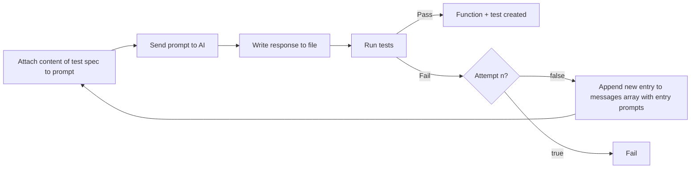

There's [research](https://arxiv.org/abs/2312.04687) taking place that is attempting to take TDD to another level. As David showcases in [this blog post](https://codeinthehole.com/tips/llm-tdd-loop-script/), we can write a test spec and have our AI agent generate code, looping over and adjusting the code until the tests pass.

You can read all of the code provided in this blog post on [Github](https://github.com/CodyBontecou/typescript-llm4tdd-example).

## Agentic flow

In this post, I will walk you through the Agentic flow showcased in the diagram below. Each section of this blog will be an implementation of each node.



Using [David's](https://codeinthehole.com/tips/llm-tdd-loop-script/) shell script as a starting point, we will convert his script to Typescript using the tools:

1. [OpenAI's Node SDK](https://github.com/openai/openai-node)
2. [Vite](https://github.com/vitejs/vite)
3. [Vitest](https://github.com/vitest-dev/vitest)
4. [Zod](https://github.com/colinhacks/zod)

Then we'll explore how to build on top of the agent to call other LLM's to build a more resilient system.
## Project Setup

Let's start by creating a new project with the necessary dependencies.

### Dependencies

Create the project

```bash
npm init --yes
```

Install the dependencies

```bash
npm install openai vitest zod
```

Typescript Execute

```bash
npm install -D tsx
```


### Typescript config

Here's the `tsconfig.json` file that I'm using:

```json
{
  "compilerOptions": {
    "target": "ES2022",
    "module": "ESNext",
    "moduleResolution": "node",
    "esModuleInterop": true,
    "strict": true,
    "outDir": "dist",
    "skipLibCheck": true,
    "forceConsistentCasingInFileNames": true
  },
  "include": ["**/*.ts"],
  "exclude": ["node_modules"]
}
```

### OpenAI API Key

We'll be using OpenAI due to their ease-of-use and flexible [SDK](https://github.com/openai/openai-node). We need an OpenAI API key to access it via code, so let's set that up.

Login to OpenAI's [developer platform](https://platform.openai.com/) and click the settings cog in the top right corner:


Then API keys:


Click the `+ Create new secret key` button and finish the forms.


Copy your new key and **save it into a .env file within your newly created project**:


## Generate function from spec

Create a file at `utils/generateFunctionFromSpec.ts`. We will add snippets of code to it as we move through our diagram. For now, just add the skeleton of the function:

```ts
// utils/generateFunctionFromSpec.ts

/**
 * Generates a function implementation from a test specification using AI
 * @param testFilePath Path to the test specification file
 * @param outputFilePath Path where the generated function should be saved
 * @param options Optional configuration parameters
 * @returns Promise that resolves to the generated content if successful, or null if all attempts failed
 */
export async function generateFunctionFromSpec(
    testFilePath: string,
    outputFilePath: string,
    options: {
        customPrompt?: string
        maxAttempts?: number
        testCommand?: string
    } = {}
): Promise<string | null> {}
```

Now import this function into an `index.ts` file in our root directory:

```ts
import { generateFunctionFromSpec } from './utils'

/**
 * Complete TDD workflow:
 * 1. Generate a function implementation that passes the tests
 */
async function runTDDWorkflow() {
    try {
        await generateFunctionFromSpec('tests/add.spec.ts', 'add.ts')
    } catch (error) {
        console.error('Workflow failed:', error)
    }
}

// Run the TDD workflow
runTDDWorkflow()
```

Update our `package.json` file to run this file:

```json
{
  "name": "typescript-example",
  "version": "1.0.0",
  "main": "index.js",
  "type": "module",
  "scripts": {
    "test": "vitest run",
    "tdd": "tsx index.ts"
  },
  "keywords": [],
  "author": "",
  "license": "ISC",
  "description": "",
  "dependencies": {
    "openai": "^4.86.1",
    "vitest": "^3.0.7",
    "zod": "^3.24.2"
  },
  "devDependencies": {
    "tsx": "^4.19.3"
  }
}
```

You should now be able to run program using the command `npm run tdd`. This will use [tsx](https://tsx.is/) to compile and run our `index.ts` file which calls `generateFunctionFromSpec`. We will spend the majority of our time in the individual functions and use `index.ts` as our main file.
## Programmatically prompting the LLM

> Node #1: Attach content of test spec to prompt.

Now, let's work on Node #1 in our agentic loop. The goal is to attach the content of the test file to our prompt to add context to the question before we send it.

We'll use a simple `readFileContent` function to attach the test file's content to our prompt. I placed this code into `utils/readFileContent.ts`, but you are welcome to organize your project to whatever works best.

```ts
// utils/readFileContent.ts

import * as fs from 'fs'
import * as path from 'path'
import { fileURLToPath } from 'url'

const __filename = fileURLToPath(import.meta.url)
const __dirname = path.dirname(__filename)

// Read file content programmatically
export const readFileContent = (filePath: string): string => {
    try {
        const absolutePath = path.resolve(__dirname, '..', filePath)
        return fs.readFileSync(absolutePath, 'utf8')
    } catch (error) {
        console.error(`Error reading file ${filePath}:`, error)
        return ''
    }
}
```

Create a `tests` directory and place our test spec file `add.spec.ts` into it.

```ts
// tests/add.spec.ts
import { describe, it, expect } from 'vitest'
import { add } from './add'

describe('add function', () => {
    it('should return the sum of multiple numbers', () => {
        expect(add(1, 2, 3)).toBe(6)
    })

    it('should return 0 if no arguments are passed', () => {
        expect(add()).toBe(0)
    })

    it('should return the same number if one number is passed', () => {
        expect(add(5)).toBe(5)
    })

    it('should handle negative numbers', () => {
        expect(add(-1, -2, -3)).toBe(-6)
    })
})
```

Now, update our `generateFunctionFromSpec` function to create a prompt, read the inputted file's content, and add the test file's content to the prompt within a `messages` array. We will eventually send the `messages` array to OpenAI/ChatGPT

```ts
// utils/generateFunctionFromSpec.ts
export async function generateFunctionFromSpec(
    testFilePath: string,
    outputFilePath: string,
    options: {
        customPrompt?: string
        maxAttempts?: number
        testCommand?: string
    } = {}
): Promise<string | null> {
    const { customPrompt, maxAttempts = 5, testCommand } = options

    // Default prompt if none provided
    const basePrompt =
        customPrompt ||
        `
    Write a Typescript module that will make these tests pass and conforms to the passed conventions.

    Only return executable Typescript code
    Do not return Markdown output
    Do not wrap code in triple backticks
    Do not return YAML
`

    // Read the test specification file
    const testSpec = readFileContent(testFilePath)

    // Initialize message history
    const messages: ChatCompletionMessageParam[] = [
        { role: 'system', content: basePrompt + testSpec },
    ]
	
	console.log(messages)
	
	return null
}
```

If you run what we have so far, the `console.log` should return the following from our constructed `messages` array:

```json
[
  {
    role: 'system',
    content: '\n' +
      '    Write a Typescript module that will make these tests pass and conforms to the passed conventions.\n' +
      '\n' +
      '    Only return executable Typescript code\n' +
      '    Do not return Markdown output\n' +
      '    Do not wrap code in triple backticks\n' +
      '    Do not return YAML\n' +
      "import { describe, it, expect } from 'vitest'\n" +
      "import { add } from './add'\n" +
      '\n' +
      "describe('add function', () => {\n" +
      "    it('should return the sum of multiple numbers', () => {\n" +
      '        expect(add(1, 2, 3)).toBe(6)\n' +
      '    })\n' +
      '\n' +
      "    it('should return 0 if no arguments are passed', () => {\n" +
      '        expect(add()).toBe(0)\n' +
      '    })\n' +
      '\n' +
      "    it('should return the same number if one number is passed', () => {\n" +
      '        expect(add(5)).toBe(5)\n' +
      '    })\n' +
      '\n' +
      "    it('should handle negative numbers', () => {\n" +
      '        expect(add(-1, -2, -3)).toBe(-6)\n' +
      '    })\n' +
      '})\n'
  }
]
```

Programmatically managing the messages prompt gives us a lot of power over the LLM. In the following section, we will begin to send this messages array to our LLM and agentically adjusting it.

## Sending prompt to AI

> Node #2: Let's chat with ChatGPT

Let's build a simple interaction with our LLM, sending our `messages` array to ChatGPT via their SDK.

Here's the `chat` function I use. The file is located at `utils/chat.ts`. It takes in our `messages` array and returns the content results.

```ts
import OpenAI from 'openai'
import { ChatCompletionMessageParam } from 'openai/resources'

const openai = new OpenAI()
const model = 'gpt-4o-mini'

export async function chat(messages: ChatCompletionMessageParam[]) {
    try {
        const completion = await openai.chat.completions.create({
            model,
            messages,
        })

        return completion.choices[0].message.content
    } catch (error) {
        console.error('Error:', error)
        return null
    }
}
```