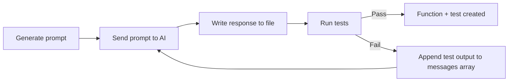
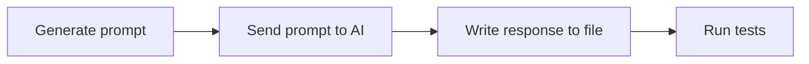
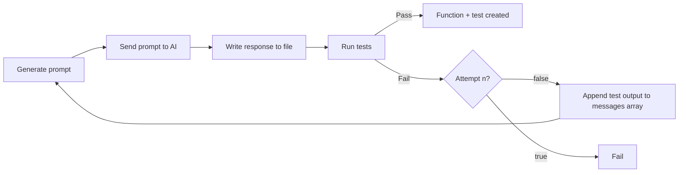

[AI](https://arxiv.org/abs/2312.04687) takes TDD to another level: [here](https://codeinthehole.com/tips/llm-tdd-loop-script/), David writes a test spec and the AI agent generates code, looping over and adjusting the code until the tests pass.

## Agentic flow

This post walks you through the Agentic flow showcased in the diagram below. Each section of this blog implements a node.



Using [David's](https://codeinthehole.com/tips/llm-tdd-loop-script/) shell script as a starting point, we convert his script to Typescript using:

1. [OpenAI's Node SDK](https://github.com/openai/openai-node)
2. [Vite](https://github.com/vitejs/vite)
3. [Vitest](https://github.com/vitest-dev/vitest)
4. [Zod](https://github.com/colinhacks/zod)

## Project Setup

Let's start by creating a new project with the necessary dependencies.

[Nodejs](https://nodejs.org/) must be installed and working on your computer. I built this using Node v20.11.1.

- Create the project:

    ```bash
    npm init --yes
    ```

### Dependencies

- Install runtime dependencies:

    ```bash
    npm install openai zod
    ```

- Install development tools:

  - `vitest` (Vite test runner)

  - `tsx` (Typescript Execute)

    ```bash
    npm install -D vitest tsx 
    ```

- Create `tsconfig.json` and add the following:

    ```json
    {
    "compilerOptions": {
        "target": "ES2022",
        "module": "ESNext",
        "moduleResolution": "node",
        "esModuleInterop": true,
        "strict": true,
        "outDir": "dist",
        "skipLibCheck": true,
        "forceConsistentCasingInFileNames": true
    },
    "include": ["**/*.ts"],
    "exclude": ["node_modules"]
    }
    ```

### OpenAI API Key

To access [OpenAI](https://github.com/openai/openai-node) programmatically, we need an API key.

1. Login to OpenAI's [developer platform](https://platform.openai.com/), click into "settings", then "API keys":


Click the "+ Create new secret key" button and finish the forms.


Copy your new key and **save it into a .env file within your newly created project**.

> This is a secret key, so we exclude it from the GitHub repository by adding `.env` to the `.gitignore`.

## Generate function from spec

Create a file at `utils/generateFunctionFromSpec.ts`.
We'll add snippets of code to it as we move through our diagram.
Here's the skeleton of the function:

```ts
// utils/generateFunctionFromSpec.ts

/**
 * Generates a function implementation from a test specification using AI
 * @param testFilePath Path to the test specification file
 * @param outputFilePath Path where the generated function should be saved
 * @param options Optional configuration parameters
 * @returns Promise that resolves to the generated content if successful, or null if all attempts failed
 */
export async function generateFunctionFromSpec(
    testFilePath: string,
    outputFilePath: string,
    options: {
        customPrompt?: string
        maxAttempts?: number
        testCommand?: string
    } = {}
): Promise<string | null> {}
```

We import this function into an `index.ts` file in the root directory:

```ts
import { generateFunctionFromSpec } from './utils'

/**
 * Complete TDD workflow:
 * 1. Generate a function implementation that passes the tests
 */
async function runTDDWorkflow() {
    try {
        await generateFunctionFromSpec('tests/add.spec.ts', 'add.ts')
    } catch (error) {
        console.error('Workflow failed:', error)
    }
}

// Run the TDD workflow
runTDDWorkflow()
```

Update our `package.json` file to run this file:

```json
{
  "name": "typescript-example",
  "version": "1.0.0",
  "main": "index.js",
  "type": "module",
  "scripts": {
    "test": "vitest run",
    "tdd": "tsx index.ts"
  },
  "keywords": [],
  "author": "",
  "license": "ISC",
  "description": "",
  "dependencies": {
    "openai": "^4.86.1",
    "vitest": "^3.0.7",
    "zod": "^3.24.2"
  },
  "devDependencies": {
    "tsx": "^4.19.3"
  }
}
```

Now run the program with the command `npm run tdd`. This uses [tsx](https://tsx.is/) to compile and run the `index.ts` file which calls `generateFunctionFromSpec`. We spend the majority of our time in the individual functions and use `index.ts` as our main file.

## Programmatically prompting the LLM

> Node #1: Generate prompt.

The goal of Node #1 in our agentic loop is to attach the content of the test file to our prompt, adding context to the prompt before we send it.

The `readFileContent` function extracts the file's content:

```ts
// utils/readFileContent.ts

import * as fs from 'fs'
import * as path from 'path'
import { fileURLToPath } from 'url'

const __filename = fileURLToPath(import.meta.url)
const __dirname = path.dirname(__filename)

// Read file content programmatically
export const readFileContent = (filePath: string): string => {
    try {
        const absolutePath = path.resolve(__dirname, '..', filePath)
        return fs.readFileSync(absolutePath, 'utf8')
    } catch (error) {
        console.error(`Error reading file ${filePath}:`, error)
        return ''
    }
}
```

Create a `tests` directory and place our test spec file `add.spec.ts` into it.

```ts
// tests/add.spec.ts
import { describe, it, expect } from 'vitest'
import { add } from './add'

describe('add function', () => {
    it('returns the sum of multiple numbers', () => {
        expect(add(1, 2, 3)).toBe(6)
    })

    it('returns 0 if no arguments are passed', () => {
        expect(add()).toBe(0)
    })

    it('returns the same number if one number is passed', () => {
        expect(add(5)).toBe(5)
    })

    it('handles negative numbers', () => {
        expect(add(-1, -2, -3)).toBe(-6)
    })
})
```

- Update our `generateFunctionFromSpec` function to create a prompt
- Read the inputted file's content,
- Add the test file's content to the prompt within a `messages` array.

Crafting the `messages` array for ChatGPT:

```ts
// utils/generateFunctionFromSpec.ts
export async function generateFunctionFromSpec(
    testFilePath: string,
    outputFilePath: string,
    options: {
        customPrompt?: string
        maxAttempts?: number
        testCommand?: string
    } = {}
): Promise<string | null> {
    const { customPrompt, maxAttempts = 5, testCommand } = options

    // Default prompt if none provided
    const basePrompt =
        customPrompt ||
        `
    Write a Typescript module that passes these tests.

    Only return executable Typescript code
    Do not return Markdown output
    Do not wrap code in triple backticks
    Do not return YAML
`

    // Read the test specification file
    const testSpec = readFileContent(testFilePath)

    // Initialize message history
    const messages: ChatCompletionMessageParam[] = [
        { role: 'system', content: basePrompt + testSpec },
    ]
 
 console.log(messages)
 
 return null
}
```

`npm run tdd` logs our constructed `messages` array:

```json
[
  {
    role: 'system',
    content: '\n' +
      '    Write a Typescript module that passes these tests.\n' +
      '\n' +
      '    Only return executable Typescript code\n' +
      '    Do not return Markdown output\n' +
      '    Do not wrap code in triple backticks\n' +
      '    Do not return YAML\n' +
      "import { describe, it, expect } from 'vitest'\n" +
      "import { add } from './add'\n" +
      '\n' +
      "describe('add function', () => {\n" +
      "    it('should return the sum of multiple numbers', () => {\n" +
      '        expect(add(1, 2, 3)).toBe(6)\n' +
      '    })\n' +
      '\n' +
      "    it('should return 0 if no arguments are passed', () => {\n" +
      '        expect(add()).toBe(0)\n' +
      '    })\n' +
      '\n' +
      "    it('should return the same number if one number is passed', () => {\n" +
      '        expect(add(5)).toBe(5)\n' +
      '    })\n' +
      '\n' +
      "    it('should handle negative numbers', () => {\n" +
      '        expect(add(-1, -2, -3)).toBe(-6)\n' +
      '    })\n' +
      '})\n'
  }
]
```

Programmatically managing the messages prompt gives us a lot of power over the LLM.

## Sending prompt to AI

> Node #2: Send our `messages` array to ChatGPT via their SDK.

The `chat` function takes in `messages`, returning the content results.

```ts
// utils/chat.ts
import OpenAI from 'openai'
import { ChatCompletionMessageParam } from 'openai/resources'

const openai = new OpenAI()
const model = 'gpt-4o-mini'

export async function chat(messages: ChatCompletionMessageParam[]) {
    try {
        const completion = await openai.chat.completions.create({
            model,
            messages,
        })

        return completion.choices[0].message.content
    } catch (error) {
        console.error('Error:', error)
        return null
    }
}
```

Add `call` to `generateFunctionFromSpec`:

```ts
// utils/generateFunctionFromSpec.ts
export async function generateFunctionFromSpec(
    testFilePath: string,
    outputFilePath: string,
    options: {
        customPrompt?: string
        maxAttempts?: number
        testCommand?: string
    } = {}
): Promise<string | null> {
    const { customPrompt, maxAttempts = 5, testCommand } = options

    // Default prompt if none provided
    const basePrompt =
        customPrompt ||
        `
    Write a Typescript module that passes these tests.

    Only return executable Typescript code
    Do not return Markdown output
    Do not wrap code in triple backticks
    Do not return YAML
`

    // Read the test specification file
    const testSpec = readFileContent(testFilePath)

    // Initialize message history
    const messages: ChatCompletionMessageParam[] = [
        { role: 'system', content: basePrompt + testSpec },
    ]
 
 const response = await chat(messages)
 console.log(response)
 
 return null
}
```

Run this to see a response. The response may look like this:

```ts
function add(...numbers: number[]): number {
    return numbers.reduce((sum, num) => sum + num, 0);
}

export { add };
```

> Your response may be difference due to ChatGPT's randomness.

Copy and pasting the returned response to an `add.ts` file in the root directory and run `npm run test`.

This tests the `add.ts` file against the test `add.spec.ts`. The generated add function should pass the tests.

*Let's automate this.*

## Writing the LLM response to file

> Node #3:  Write response to file

Our LLM is returning working code, but right now we are manually:

1. Logging the response to the console
2. Copy + pasting the output to a file
3. Manually running the test command.

Now we add a function that writes the `chat` response to a file:

```ts
// utils/writeFileContent.ts
import * as fs from 'fs'
import * as path from 'path'
import { fileURLToPath } from 'url'

const __filename = fileURLToPath(import.meta.url)
const __dirname = path.dirname(__filename)

// Write file content programmatically
export const writeFileContent = (filePath: string, content: string): void => {
    try {
        const absolutePath = path.resolve(__dirname, '..', filePath)
        fs.writeFileSync(absolutePath, content, 'utf8')
        console.log(`File ${filePath} updated successfully`)
    } catch (error) {
        console.error(`Error writing to file ${filePath}:`, error)
    }
}
```

Add the `writeFileContent` function to `generateFunctionFromSpec`:

```ts
// utils/generateFunctionFromSpec.ts
export async function generateFunctionFromSpec(
    testFilePath: string,
    outputFilePath: string,
    options: {
        customPrompt?: string
        maxAttempts?: number
        testCommand?: string
    } = {}
): Promise<string | null> {
 ...
    const messages: ChatCompletionMessageParam[] = [
        { role: 'system', content: basePrompt + testSpec },
    ]
 
 const response = await chat(messages)

    if (!response) {
        console.error('Failed to get a response from the AI.')
    } else {
        writeFileContent(outputFilePath, response)
    }
 
 return null
}
```

We have to do a bit of null-checking via the `if (!response)` code.

Once we ensure `response` is not null, we pass it to our `writeFileContent` function with the `outputFilePath`.

Running our code writes the response to `add.ts`.

Running `npm run test` to see the tests passing.

## Running our tests

> Node #4: Running tests after our function is generated

Our LLM is returning working code, but right now we are manually:

1. ~Logging the response to the console~
2. ~Copy + pasting the output to a file~
3. Manually running the test command.

We can run our tests programmatically using Node's [exec](https://nodejs.org/api/child_process.html#child_processexeccommand-options-callback) function:

```ts
// utils/runTests.ts
import { exec } from 'child_process'

/**
 * Runs tests and returns a promise with the test results
 * @param command Optional test command to run (defaults to 'npm run test')
 * @returns Promise that resolves to an object with test results
 */
export function runTests(
    command: string = 'npm run test'
): Promise<{ passed: boolean; output: string }> {
    return new Promise(resolve => {
        console.log('Running tests...')

        exec(command, (error: Error | null, stdout: string, stderr: string) => {
            let testOutput = stdout

            if (error) {
                testOutput += `\nError: ${error.message}`
            }

            if (stderr) {
                console.error(`Test stderr: ${stderr}`)
                testOutput += `\nStderr: ${stderr}`
            }

            console.log(`Test results:\n${stdout}`)

            // Check if all tests passed
            const passed =
                stdout.includes('✓') &&
                !stdout.includes('✗') &&
                !stdout.includes('fail')

            if (passed) {
                console.log('All tests passed successfully!')
            } else {
                console.log(
                    'Some tests failed. Check the output above for details.'
                )
            }

            resolve({ passed, output: testOutput })
        })
    })
}
```

There are two key things happening within this function:

1. Running `exec(command)` with command defaulting to `npm run test` which is our test command defined in our `package.json` file.
2. Checking if the tests passed.

```ts
const passed =
 stdout.includes('✓') &&
 !stdout.includes('✗') &&
 !stdout.includes('fail')
```

I'm using the output within the terminal to check against whether the tests pass.

Here's an example of the terminal output:


Our `passed` variable is parsing this output, and ensuring there are  `✓` characters and no `✗` or `fail`.

This works good enough. But, if you know of a better way please let me know!

Now, let's extend our `generateFunctionFromSpec` file to also run the tests:

```ts
// utils/generateFunctionFromSpec.ts
export async function generateFunctionFromSpec(
    testFilePath: string,
    outputFilePath: string,
    options: {
        customPrompt?: string
        maxAttempts?: number
        testCommand?: string
    } = {}
): Promise<string | null> {
 ...
    const messages: ChatCompletionMessageParam[] = [
        { role: 'system', content: basePrompt + testSpec },
    ]
 
 const response = await chat(messages)

    if (!response) {
        console.error('Failed to get a response from the AI.')
    } else {
        writeFileContent(outputFilePath, response)
        const { passed, output } = await runTests(testCommand)
        console.log(passed, output)
    }
 
 return null
}
```

## Making this agentic

> While loop = agent?

We've implemented the main flow:



The goal is to adjust our code to make it look like Anthropic's [Agents](https://www.anthropic.com/engineering/building-effective-agents) diagram:


Let's connect the labels of this diagram to our own:

- **Human:** This is the test file we wrote ([add.test.ts](https://github.com/CodyBontecou/typescript-llm4tdd-example/blob/01/add/tests/add.spec.ts)) ✅.
- **LLM Call**: This is our [chat](https://github.com/CodyBontecou/typescript-llm4tdd-example/blob/01/add/utils/chat.ts) function talking to ChatGPT with a prompt built alongside our test file's content ✅.
- **Environment:** This is a check to see if our tests pass ([runTests.ts](https://github.com/CodyBontecou/typescript-llm4tdd-example/blob/01/add/utils/runTests.ts)) ✅.
  - *Feedback* is the response from our tests ✖︎.
  - *Action* is running our tests with the new response from the LLM ✖︎.
- **Stop:** This occurs when our tests pass ✖︎.

We've built the data flow, but we haven't built the ability to take in feedback and apply it to future actions when the tests do not pass.

This is where the **while** loop comes in.

Adjust `generateFunctionFromSpec` to continuously run until our tests pass:

```ts
// utils/generateFunctionFromSpec.ts
export async function generateFunctionFromSpec() {
 // Commented the rest of the function for brevity
    let testPassed = false
    while (!testPassed) {
        const response = await chat(messages)
        if (!response) {
            console.error('Failed to get a response from the AI.')
            break
        }
        // Save implementation and run tests
        writeFileContent(outputFilePath, response)
        const { passed } = await runTests(testCommand)
        testPassed = passed
    }
 return null
}
```

**Congratulations! You've built your first agent.**

Run `index.ts` using the `npm run tdd` script to continuously call ChatGPT until it generates an `add.ts` function that passes our tests.

There are a few issues with this approach:

1. This can be infinite - *what if you write a test that can never pass?*
2. There is no feedback.

## Improving the agent with maxAttempts

> This can potentially be infinite - *what if you write a test that can never pass?*

There are cases where you may want an agent constantly on in the background in an infinite loop, but this is not one of them.

Our agent needs an escape hatch.

Create a `maxAttempts` variable that is kept track of during our while loop. After each iteration, increment `attempts` until it equals `maxAttempts`. The loop ends if they are equal.



The goal is to break out of the agent if one of two conditions are met:

1. Tests pass
2. `attempts === maxAttempts`

Our test passing case is in place, but not the attempts logic:

```ts
// utils/generateFunctionFromSpec.ts
export async function generateFunctionFromSpec(
 options: {
         customPrompt?: string
         maxAttempts?: number
         testCommand?: string
     } = {}
    ) {
 // Commented the rest of the function for brevity
 const { customPrompt, maxAttempts = 5, testCommand } = options

    let testPassed = false
 let attempts = 0
    while (!testPassed && attempts < maxAttempts) {
        attempts++
        const response = await chat(messages)
        if (!response) {
            console.error('Failed to get a response from the AI.')
            break
        }
        // Save implementation and run tests
        writeFileContent(outputFilePath, response)
        const { passed } = await runTests(testCommand)
        testPassed = passed
    }
 return null
}
```

Here we extract the `maxAttempts` value from our function's `options` parameter. If the `maxAttempts` option is not passed to the function, it defaults to 5.

Then we define `let attempts = 0`, increment if every loop iteration, and adjust the while loop to check if we've reached our `maxAttempts`:

```ts
while (!testPassed && attempts < maxAttempts) {
 attempts++
 // rest of our code
}
```

Our code should now run continuously until our tests pass or once we reach our pre-defined max attempts.

## Adapting our prompt to feedback

We want each agentic loop (attempt) to apply the feedback we received during the previous iteration.

We use the logs the tests prints to the console. A failing test provides high-quality information about the failure.

Append `output` to our `messages` array so every attempt has the necessary context within the agentic loop.

```ts
export async function generateFunctionFromSpec() {
 // Commented the rest of the function for brevity
 const messages: ChatCompletionMessageParam[] = [
        { role: 'system', content: basePrompt + testSpec },
    ]

    let testPassed = false
    let attempts = 0

    while (!testPassed && attempts < maxAttempts) {
        attempts++
        const response = await chat(messages)

        if (!response) {
            console.error('Failed to get a response from the AI.')
            break
        }

        messages.push({ role: 'assistant', content: response })

        // Save implementation and run tests
        writeFileContent(outputFilePath, response)
        const { passed, output } = await runTests(testCommand)
        testPassed = passed

        messages.push({
            role: 'system',
            content:
                'Tests are failing with this output. Try again.\n\n' + output,
        })
    }
}
```

Here's the final source code of our `generateFunctionFromSpec` function:

```ts
import { ChatCompletionMessageParam } from 'openai/resources'
import { chat } from './chat'
import { readFileContent } from './readFileContent'
import { writeFileContent } from './writeFileContent'
import { runTests } from './runTests'

/**
 * Generates a function implementation from a test specification using AI
 * @param testFilePath Path to the test specification file
 * @param outputFilePath Path where the generated function should be saved
 * @param options Optional configuration parameters
 * @returns Promise that resolves to the generated content if successful, or null if all attempts failed
 */
export async function generateFunctionFromSpec(
    testFilePath: string,
    outputFilePath: string,
    options: {
        customPrompt?: string
        maxAttempts?: number
        testCommand?: string
    } = {}
): Promise<string | null> {
    const { customPrompt, maxAttempts = 5, testCommand } = options

    // Default prompt if none provided
    const basePrompt =
        customPrompt ||
        `
    Write a Typescript module that passes these tests.

    Only return executable Typescript code
    Do not return Markdown output
    Do not wrap code in triple backticks
    Do not return YAML
`

    // Read the test specification file
    const testSpec = readFileContent(testFilePath)

    // Initialize message history
    const messages: ChatCompletionMessageParam[] = [
        { role: 'system', content: basePrompt + testSpec },
    ]

    let testPassed = false
    let attempts = 0
    while (!testPassed && attempts < maxAttempts) {
        attempts++
        const response = await chat(messages)

        if (!response) {
            console.error('Failed to get a response from the AI.')
            break
        }

        messages.push({ role: 'assistant', content: response })

        // Save implementation and run tests
        writeFileContent(outputFilePath, response)
        const { passed, output } = await runTests(testCommand)
        testPassed = passed

        messages.push({
            role: 'system',
            content:
                'Tests are failing with this output. Try again.\n\n' + output,
        })
    }

    return null
}
```

You can read all of the code provided in this blog post on [Github](https://github.com/CodyBontecou/typescript-llm4tdd-example).
