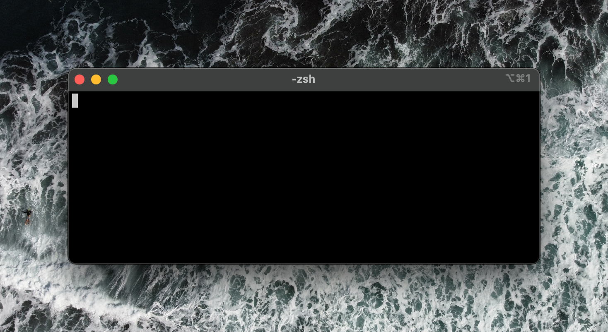

# {{ $frontmatter.title }}

Minimal setups are great when trying to focus. The standard terminal window can get cluttered. In this tutorial, I will show you how to configure your terminal window to go from this:

```bash
Cody-MacBook-Pro:~ codybontecou$
```

to this:

```
~ $
```

## Edit your terminal config file

I'm using `zsh` as my default shell, but this should be the same if you bash.

1. Edit your `.zshrc` file
2. Add and/or edit the value `PS1`.

Here is a cheatsheet to explain the accepted values for the `PS1` key/value provided by [user3439894 of stackexchange](https://apple.stackexchange.com/questions/224149/show-username-on-mac-terminal-prompt).

```bash
PS1='\h:\W \u\$ '

PS1 The value of this parameter is expanded (see PROMPTING below) and used as the primary prompt string.
=   equals
'   single quote
\h  the hostname up to the first ‘.’
:   colon
\W  the basename of the current working directory, with $HOME abbreviated with a tilde
    white space
\u  the username of the current user
\$  if the effective UID is 0, a #, otherwise a $
    white space
'   single quote

Examples:

MacBookPro:~ user$
MacBookPro:Documents user$
MacBookPro:~ root#
```

## My preference

I personally use `PS1=''` within my `.zshrc` file. This provides a blank prompt which feels good to me. If I ever get lost, I type a quick `pwd` to see where I am, but I rarely run into that problem.

And cmon, this looks great!



